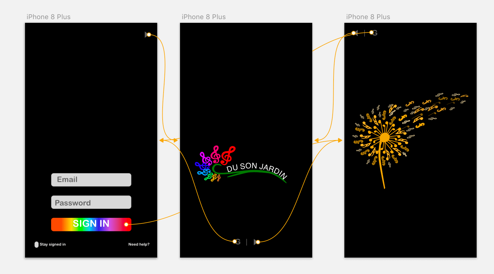
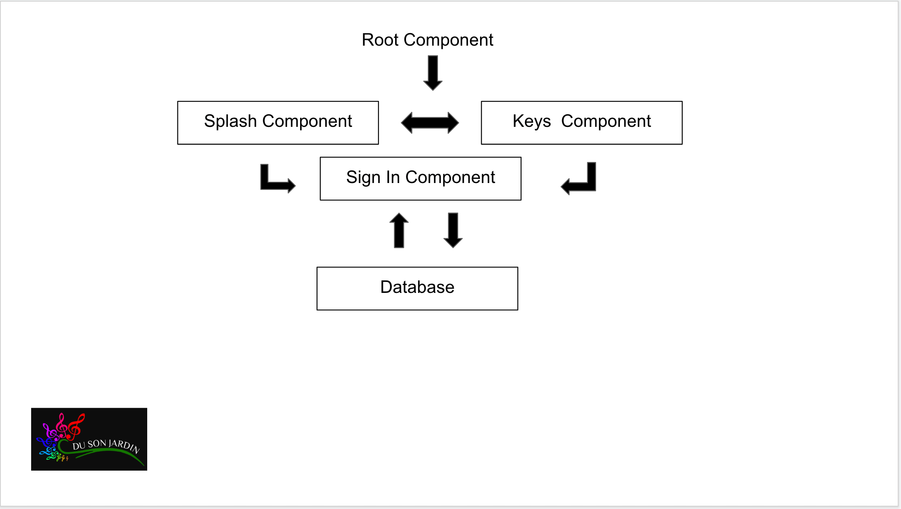

# DuSonJardin

## Getting Started

Every image asset in this project was custom created from scratch in sketch and each sound is copyright free.

1. Clone Project (revival branch is set to default)
2. `npm install`
3. `ng serve` for dev or `ng serve --prod` for optimized
4. Navigate to `http://localhost:4200/`. The app will automatically reload if you change any of the source files
5. Type or click the screen and be sure to check out mobile!

* google icon is currently not in use and Oauth has been removed

If issues occur, try running `npm audit` at project base and then `ng serve` again.

 __Tasks :__

         - [x] A completed task
         - [ ] An uncompleted task

 __MVP :__

         - [x] Logo
         - [x] Splash Page
         - [x] Grid System
         - [x] Basic Sound Functionality on key press
         - [ ] Login Authentication
         - [?] Readme lookin' nice
         - [x] Reassign sounds to custom keys
         - [x] Animation on key press
         - [ ] MultiTouch mobile capability

 __Stretch Goals :__

         - [ ] Varied/unique/random animation on key press
         - [ ] Svg animation with anime.js
         - [ ] Upload custom audio
         - [ ] Clickable divs to enable mobile use
         - [ ] Record beats
         - [ ] Optimization

  __Optimization :__

         - [x/100] Performance
         - [x/100] Accessibility
         - [x/100] Best Practices
         - [x/100] SEO
         - [x/100] Progressive Web App

## Planning

## Sketch Work

## Further Exploration / Future Updates

* split screen between melodic and rhythmic
* ngAudio
* ngAnimate

## Code scaffolding

Run `ng generate component component-name` to generate a new component. You can also use `ng generate directive|pipe|service|class|guard|interface|enum|module`.

## Build

Run `ng build` to build the project. The build artifacts will be stored in the `dist/` directory. Use the `-prod` flag for a production build.

## Running unit tests

Run `ng test` to execute the unit tests via [Karma](https://karma-runner.github.io).

## Running end-to-end tests

Run `ng e2e` to execute the end-to-end tests via [Protractor](http://www.protractortest.org/).

## In Conclusion

Tests are no longer implemented in the project's current state.
In general, the code is not in tip-top form as the structure and conventions could definitely use some work. In the future, I would like to refactor the code to be more DRY as well as create more elaborate and custom animations for each image imported. I believe this idea has great potential and the execution through angular does not quite live up to the quality of ideas and assets that went into it. 

## Credits 

This project was a group effort back in April, 2019 and the revival branch is an effort to bring this back to life as many packages had depreciated and the animations were never fully functional beforehand. I owe a big thanks to everyone from Epicodus who helped in the creation of this project! I encourage you to go check them out on LinkedIn

[Victoria Martinez](https://www.linkedin.com/in/victoria-martinez72/)

[Nelia Terrazas](https://www.linkedin.com/in/nelia-terrazas/)

[Kohichi Horii](https://www.linkedin.com/in/kohichi-horii/)

[Me](https://www.linkedin.com/in/isaacdev/)

